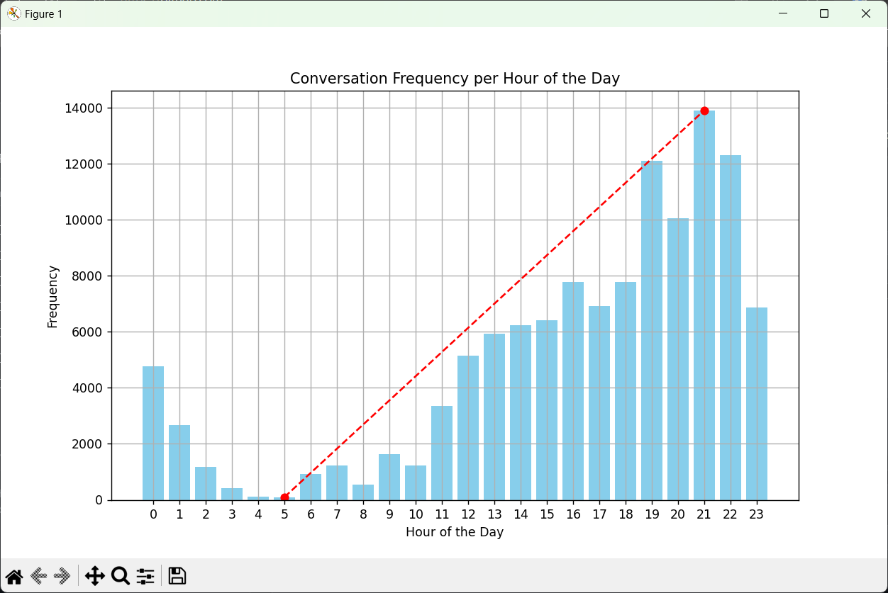

# Conversational Frequency Analyzer

This script analyzes the conversational frequency per hour of the day based on a JSON file containing timestamps of messages. It generates a graphical representation of the data, showing when most conversations occur during the day.

## Requirements

- Python 3
- Matplotlib library

## Installation

1. Clone this repository to your local machine:

```
git clone https://github.com/cusssy/conversational-frequency-analyzer.git
```

2. Install the required dependencies using pip:

```
pip install matplotlib
```

## Usage

1. Request your data from Discord. To do this, follow these steps:
   - Go to the Discord website and log in to your account.
   - Click on the User Settings icon (the gear icon) located in the bottom left corner.
   - In the User Settings menu, select "Privacy & Safety".
   - Scroll down to the "Download Your Data" section.
   - Click on the "Request Data" button and follow the instructions to complete the request. Discord will email you a link to download your data once it's ready.

2. Once you receive the email from Discord with a link to download your data, download the data and locate the JSON file containing the timestamps of messages.

3. Clone this repository to your local machine:


```

2. Run the script by executing the following command in your terminal:

```
python graphic.py
```

3. Enter the name of your JSON file when prompted.

4. The script will generate a graphical representation of the conversational frequency per hour of the day and display it on the screen.

## Example

```bash
Enter the name of the JSON file: messages.json
```



